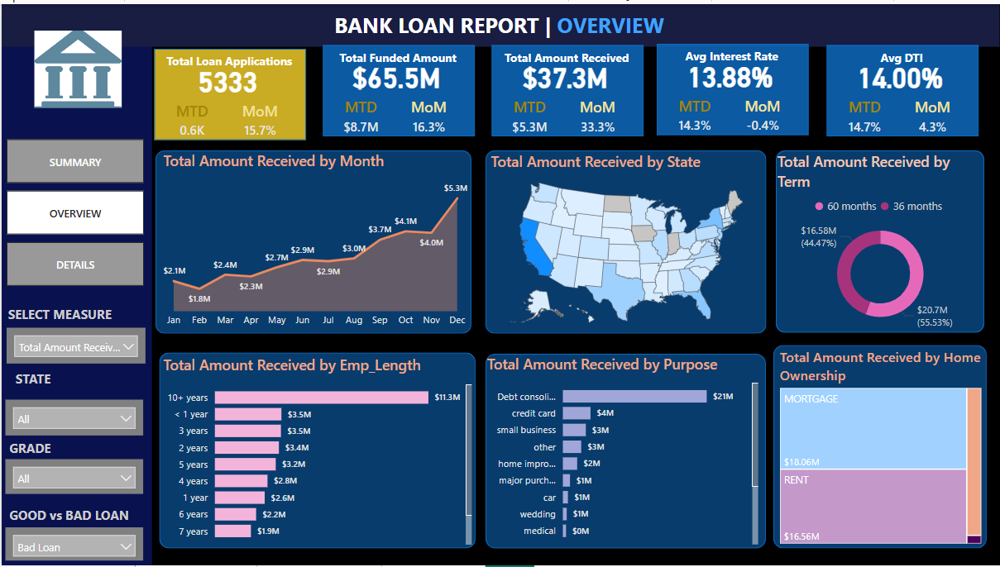

# Bank-Loan-Analysis

# 🏦 Bank Loan Analytics Dashboard

An interactive and comprehensive Power BI dashboard project that visualizes and analyzes key performance indicators (KPIs) of bank loans, providing insights into loan distributions, repayment behavior, borrower characteristics, and loan health (Good vs. Bad).

---

## 📌 Project Summary

This project provides a visual and data-driven overview of bank loan applications, funded amounts, repayments, and borrower profiles. Built using SQL and Power BI, it showcases how business intelligence tools can help financial institutions evaluate loan performance and credit risk more effectively.

---
## 📌 Project Objective

This dashboard aims to:
- Track the overall performance of issued loans.
- Distinguish between good and bad loans based on repayment behavior.
- Analyze trends by month, purpose, location, home ownership, employment length, and more.
- Provide actionable insights for financial analysts, loan officers, and business stakeholders.

---
## 🛠️ Tools & Technologies Used

- **SQL (MySQL)** – Data extraction and KPI aggregation  
- **Power BI** – Dashboard design, visualization, interactivity  
- **DAX** – Custom measures and calculated fields  
- **Bank Loan Dataset** – Includes loan amount, interest rate, loan status, borrower info, etc.

---

## ✅ What I Did

- Cleaned and queried the raw bank loan dataset using SQL
- Created calculated KPIs like funded amount, total payments, average interest, DTI, etc.
- Designed three Power BI dashboard pages: **Summary**, **Overview**, and **Details**
- Applied slicers/filters for interactive analysis across loan status, term, purpose, and grade
- Visualized trends by **month**, **state**, **loan purpose**, **home ownership**, and more

---
## 📊 Key Highlights

| Metric                      | Value          |
|----------------------------|----------------|
| Total Loan Applications    | 38.6K           |
| Total Funded Amount        | $435.8M         |
| Total Amount Received      | $473.1M         |
| Good Loans (by count)      | 33K (86.18%)    |
| Bad Loans (by count)       | 5K (13.82%)     |
| Avg. Interest Rate         | 13.88% (Bad Loans) / 12.05% (Overall) |
| Avg. Debt-to-Income (DTI)  | 14.00% (Bad Loans) / 13.33% (Overall) |

---

## 📈 Key Insights

- Over **86%** of loans were classified as *Good* (Fully Paid or Current)
- **Bad loans** had noticeably higher average interest rates and DTI ratios
- Most loans were used for **Debt Consolidation** and **Credit Card** payments
- States like **CA, TX, NY** had the highest loan application volumes
- **Grade A loans** had lower interest rates and better repayment patterns

---

## 🎯 Value & Usefulness

- Helps banks and credit analysts **identify risk factors** in loan issuance
- Enables **data-driven decisions** on loan approvals and interest rate settings
- Provides **real-time visibility** into loan portfolio health
- Can be extended to support **predictive analytics** or **fraud detection**

---
🖼️ Dashboard Screenshots  
Summary Page

Overview Page

Details Page

## 🎓 Acknowledgments

This project was inspired by a tutorial from youtube. The dashboard has been customized and extended for learning and demonstration purposes.

---

